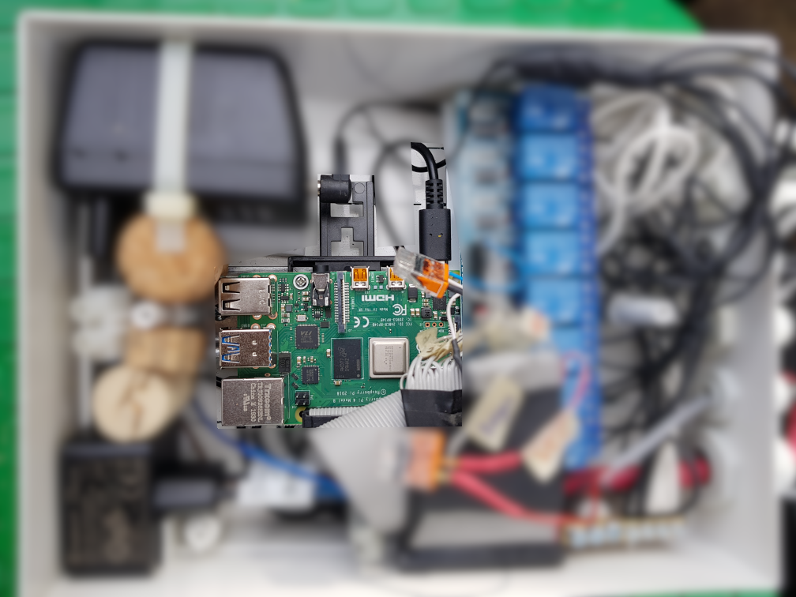
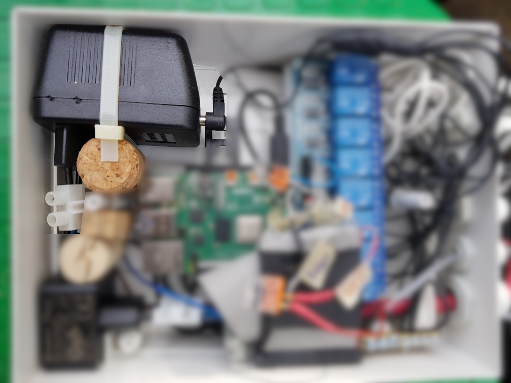
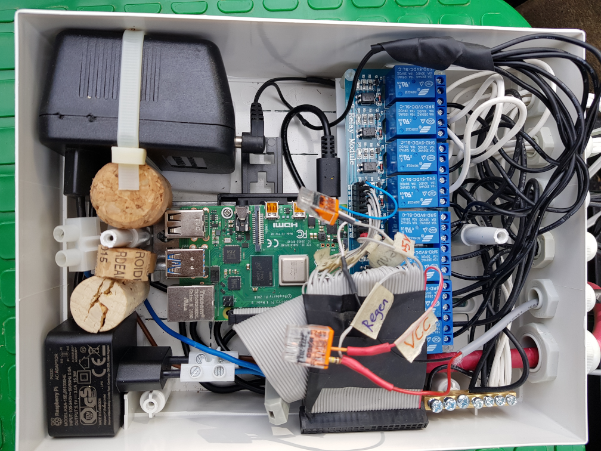

# Bewässerungsteuerung mit OpenSprinkler

Dieses Repo ist ein Fork von https://github.com/OpenSprinkler/OpenSprinkler-Firmware zum Zweck, die Software um eine **Dokumentation meiner Installation** zu erweitern. Dadurch will ich in der Lage sein, bei Bedarf die Hardware und Software meiner Steuerung erneut zu bauen. Gleichzeitig will ich es durch diese Dokumentation anderen Interessenten erleichtern, **OpenSprinkler für die Steuerung ihrer Bewässerung** einzusetzen. Beim Aufbau der Steuerung für meine Bewässerung hat sich gezeigt, dass die relevanten Informationen sehr verstreut zu finden sind.

Der **Zweck einer Bewässerungssteuerung** besteht darin, Magnetventile zeigesteuert zu öffnen, um die mit diesem Rohr verbundenen Regner und Sprüher mit Wasser zu versorgen. Dazu kann man einen Bewässerungscomputer kaufen oder eine Software wie **OpenSprinkler** auf einem **Raspberry Pi** verwenden. Letzteres hat den Vorteil, dass man Hardware und Software leicht erweitern oder tauschen kann, falls irgendwelche Anwendungsfälle das erforderlich machen. Da ich mit dem [Smart Appliance Enabler](https://github.com/camueller/SmartApplianceEnabler) selbst eine Software für Raspberry Pi entwickelt habe, war für mich die Entscheidung klar.

## Hardware
In meiner Bewässerungsanlage kommen **Magnetventile** [Rainbird 100-HV](https://www.rainbird.de/produkte/ventile/ventile-der-typenreihe-hv) mit 24V Wechselspannung zum Einsatz, die es so aber auch von anderen Herstellern gibt (z.B. Hunter).

### Raspberry Pi
Der Raspberry Pi ist mit seinen digitalen I/O-Ports perfekt zur Steuerung der Magnetventile einer Bewässerungsanlage geeignet. Weil dafür und die Web-Oberfläche von *OpenSprinkler* nicht viel Rechenleistung erforderlich ist, genügt ein Standard-Raspberry Pi 2/3/4, wobei die Grösse des Arbeitsspeichers nicht relevant sein sollte.

Die Netzwerkanbindung erfolgt bei mir über WLAN, weshalb der Ethernet-Anschluss des Raspberry Pi nicht verwendet wird. 

Ich habe den Raspberry Pi auf einen DIN-Schienenhalter geschraubt mit Hilfe dessen er im auf der DIN-Schiene des Verteilerkasten fixiert ist, aber auch leicht entnommen werden kann um beispielsweise die SD-Karte des Raspberry Pi zu wechseln.



### Netzteil für Raspberry Pi
Für den Betrieb des Raspberry Pi wird ein 5V-Netzteil benötigt, das diesen dauerhaft mit Strom versorgt. Dabei muss sichergestellt sein, dass das Netzteil ausreichend Leistung für das jeweilige Raspberry Pi-Modell dauerhaft bereitstellt.

Weil im Verteilerkasten kein Platz für eine Steckdose ist, habe ich die Stecker-Stifte des Netzteils mittels Lüsterklemmen mit dem Stromnetz verbunden.

Mittels eines Korkens ist das Netzteil in der Ecke des Verteilerkastens fixiert.



### Netzteil für Magnetventile
Zum Betrieb der Magenetventile wird ein Netzteil mit 24V Wechselspannung benötigt.

Weil im Verteilerkasten kein Platz für eine Steckdose ist, habe ich die Stecker-Stifte des Netzteils mittels Lüsterklemmen mit dem Stromnetz verbunden.

### Relais-Board
Die I/O-Ports des Raspberry Pi mit 5V-Pegel dienen nur der Steuerung von Relais, welche den 24V-AC-Stromkreis für die Magnetventile schalten. Für jedes Ventil benötigt man ein Relais. Kompakt und preisgünstig geht mit einem Relais-Board. Für meine 8 Magnetventile habe ich dementsprechend ein 8-Kanal-Relais-Board verwendet.

### Raspberry Pi I/O-Port-Kabel
Zum Anschluss des Relais-Boards an die I/O-Ports des Raspberry Pi wird ein Flachkabel mit Pfostenstecker benötigt. Wer noch alte IDE-Flachkabel herumliegen hat, kann diese verwenden - so habe ich es auch bisher immer gemacht.

### Verteilerkasten
Der Raspberry Pi mit Netzteilen und Releais-Board müssen in der Nähe der Magnetventile untergebracht werden. Ich habe mich dazu entschieden, diese Elektronik in einem Verteilerkasten unterzubringen, der wiederum neben den Magnetventilen in der Ventilbox Platz finden muss. Also darf er nicht zu gross sein, muss aber Platz für alle Bauteile bieten. Außerdem sollte er vor der Luftfeuchtigkeit und Wasser schützen. Ursprünglich war ich deswegen auf der Suche nach einem Verteilerkasten mit Schutzart IP65, konnte allerdings keinen finden mit genug Platz aber nicht zu gross für die Ventilbox. Letztlich habe ich mich für einen Aufputz-Kleinverteiler für 8 Module auf Hutschiene mit Schutzart IP40 entschieden, den bei dem ich die vorhanden Schlitze mit Heisskleber verschlossen habe und für die Kabel Löcher gebohrt habe zur Aufnahme von Kabeldurchführungen mit Quetschdichtung. Rund um die Fronttüre habe ich Teile eines alten Fahrradschlauchs als Flachdichtung platziert. Insgesamt hoffe ich, dass diese Massnahmen ausreichen, um Luftfeuchtigkeit draussen zu halten.



### Regensensor
Wenn es regnet, soll die Bewässerung nicht laufen. Ich hatte zunächst an einen Sensor zur Messung der Bodenfeuchte gedacht, aber angesichts der Probleme hinsichtlich Haltbarkeit und Aussagekraft wieder verworfen. Stattdessen verwende ich den Regensensor [Rainbird RSD-BEx](https://www.rainbird.de/produkte/rsd-bex), der mittels Korkscheiben das Verhalten des Bodens (Aufsaugen von Wasser und verzögertes Trocknen) simuliert.

## Software
### Installation des Betriebssystems
#### Raspberry Pi OS
Wie jeder Computer benötigt der Raspberry Pi ein Betriebssystem, das auf einem Speichermedium installiert ist. Letzteres ist im konkreten Fall eine SD-Karte, auf welcher das **Raspberrys Pi OS** installiert sein muss. Am einfachsten geht das mit dem [Raspberry Pi OS Imager](https://www.raspberrypi.org/software).

Nachdem sich das Image auf der SD-Karte befindet, muss der **Zugriff per SSH noch freigeschaltet** werden, indem auf der SD-Karte eine leere Datei mit dem Namen `ssh` angelegt wird. Unter Linux geht das wie folgt:
```console
$ sudo mount /dev/mmcblk0p1 /mnt
$ sudo touch /mnt/ssh
$ sudo umount /mnt
```

Jetzt kann die SD-Karte in den Raspberry Pi gesteckt werden. Soblad er auch mit dem Netzteil verbunden wird, sollt er das Raspberry Pi OS von der SD-Karten booten.

Wenn der Boot-Vorgang abgeschlossen ist, muss man sich **via SSH mit dem Raspberry verbinden** für die weiteren Installations- und Konfigurationsschritte:
```console
ssh pi@raspberrypi
```

#### WLAN aktivieren

#### Hostname setzen

#### Zeitzone setzen

#### Software aktualisieren


### Installation von OpenSprinkler

#### Git installieren

#### OpenSprinkler Firmware installieren

### Konfiguration von OpenSprinkler


Zum Setzen der Zeitzone in OpenSprinkler muss erst der Standort gelöscht werden!
siehe: https://github.com/OpenSprinkler/OpenSprinkler-Firmware/issues/84
